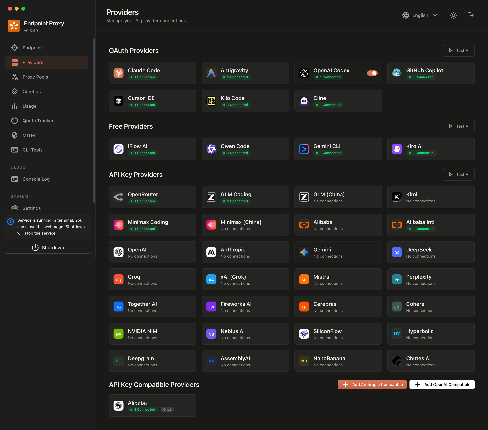
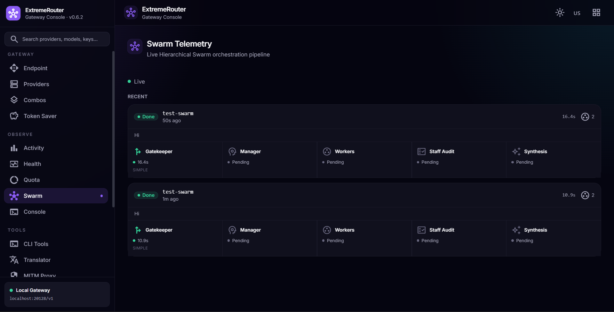
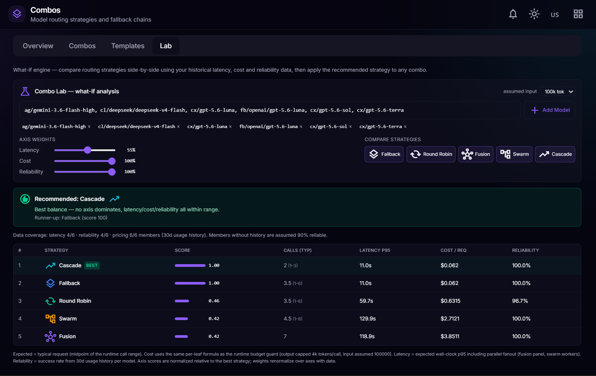
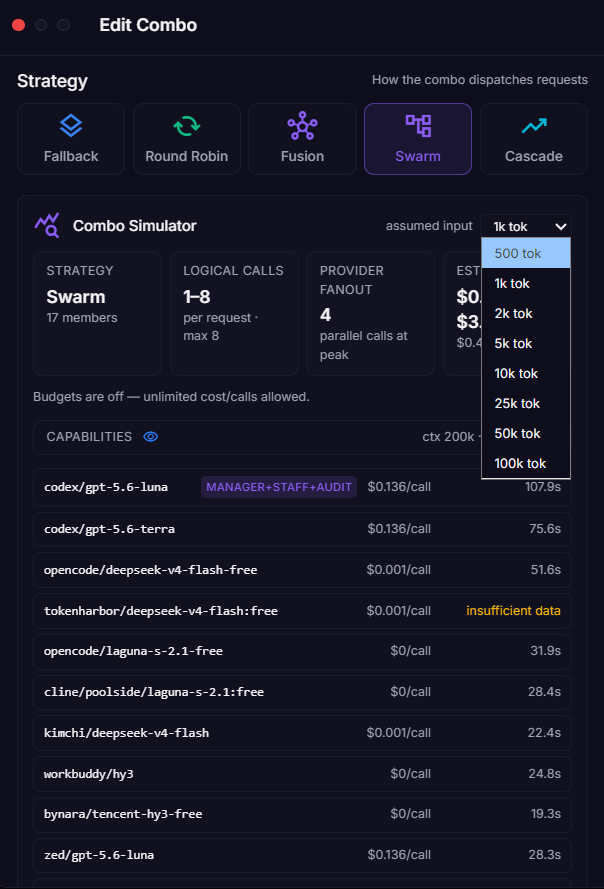
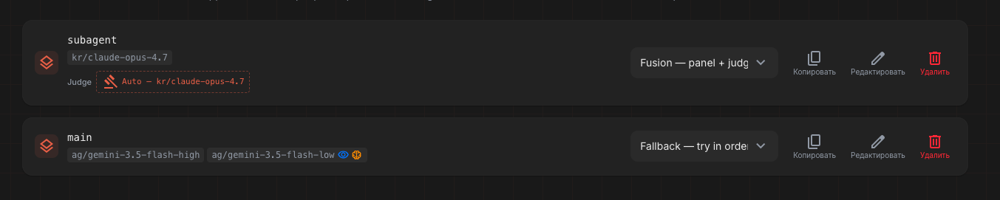

<div align="center">

# ExtremeRouter — AI Gateway Control Plane

**Gateway AI self-hosted yang merutekan trafik dari tools coding AI Anda ke 304+ provider dengan terjemahan format, fallback cerdas, pelacakan kuota, dan penghematan token 20–40%.**

Hubungkan Claude Code, Cursor, Antigravity, Copilot, Codex, Gemini, OpenCode, Cline, OpenClaw, dan klien apa pun yang kompatibel OpenAI/Anthropic ke satu endpoint terpadu.

**Bahasa:** [English](README.md) · [Bahasa Indonesia](README.id.md) · [简体中文](README.zh-CN.md)

[](https://www.npmjs.com/package/@rsalmn/extremerouter)
[](https://www.npmjs.com/package/@rsalmn/extremerouter)
[](https://hub.docker.com/r/rsalmn/extremerouter)
[](https://github.com/rsalmn/extremerouter/pkgs/container/extremerouter)
[](https://github.com/rsalmn/extremerouter/blob/main/LICENSE)

</div>

---

## Daftar Isi

- [Fitur Unggulan](#fitur-unggulan)
- [Perbandingan: 9Router vs OmniRoute vs ExtremeRouter](#perbandingan)
- [Cara Kerja](#cara-kerja)
- [Tampilan Antarmuka](#tampilan-antarmuka)
- [Mulai Cepat](#mulai-cepat)
- [Tools CLI yang Didukung](#tools-cli-yang-didukung)
- [Provider yang Didukung](#provider-yang-didukung)
- [Fitur Utama Secara Detail](#fitur-utama-secara-detail)
- [Pertanyaan yang Sering Diajukan](#pertanyaan-yang-sering-diajukan)
- [Referensi API](#referensi-api)
- [Kontributor](#kontributor)
- [Dukungan](#dukungan)
- [Grafik Bintang & Fork](#grafik-bintang--fork)
- [Penghargaan & Referensi](#penghargaan--referensi)
- [Lisensi](#lisensi)

---

<a name="fitur-unggulan"></a>

## Fitur Unggulan

| Fitur | Fungsinya | Mengapa Penting |
|-------|-----------|-----------------|
| **304+ provider, satu endpoint** | Provider API-key, OAuth, free-tier, dan 39 provider web-cookie di belakang satu permukaan `/v1` | Tidak perlu lagi berpindah-pindah base URL, key, dan dashboard |
| **Terjemahan format** | OpenAI ↔ Claude ↔ Gemini ↔ Responses ↔ Antigravity ↔ Kiro ↔ Cursor | Tools CLI apa pun bisa bicara ke provider apa pun |
| **6 strategi combo** | fallback, round-robin, fusion, swarm, cascade, smart-routing | Pilih otak routing yang sesuai dengan tugas |
| **Mesin Hierarchical Swarm** | Gatekeeper → Manager → Workers → Audit → Synthesis dengan telemetri SSE langsung | Eksekusi multi-agen paralel untuk tugas kompleks |
| **Smart Routing** | Routing sadar-tugas: tugas tool-calling ke model berkemampuan tool, riset ke provider cookie/gratis | Pemilihan model otomatis sesuai jenis tugas |
| **Strategi Cascade** | Eskalasi murah → mumpuni dengan gerbang kepercayaan diri | Bayar daya komputasi hanya saat model sederhana gagal |
| **RTK Token Saver** | Mengompres konten `tool_result` (git diff, grep, ls, tree...) sebelum dikirim | Menghemat 20–40% token input pada setiap request |
| **Ponytail & Caveman** | Penyuntik prompt YAGNI-first dan jawaban ringkas | Hingga 65% lebih sedikit token output |
| **Fallback 3-tier cerdas** | Subscription → murah → gratis, otomatis | Tidak pernah berhenti coding, nol downtime |
| **Pelacakan kuota real-time** | Hitungan token langsung dan hitung mundur reset per provider | Maksimalkan setiap subscription |
| **Round-robin multi-akun** | Beberapa akun per provider, failover otomatis | Load balancing + redundansi |
| **Refresh token otomatis** | Token OAuth di-refresh sebelum kedaluwarsa, jalur retry 401/403 | Tanpa perlu login ulang manual |
| **ACL model per-key** | Setiap API key dapat membawa daftar `allowedModels` (403 di luar daftar) | Bagikan key terbatas dengan aman |
| **Health monitor + circuit breaker** | Kesehatan per-provider jendela geser, state machine CLOSED/OPEN/HALF_OPEN | Otomatis melewati provider mati, pulih otomatis |
| **Budget combo & kontrol penerimaan** | Batas biaya per-combo, batas konkurensi per-key | Tetap di dalam batas pengeluaran |
| **A/B Lab** | Putar ulang request historis dan bandingkan strategi (fallback vs swarm vs smart-routing) | Pilih strategi termurah yang tetap menjawab |
| **Analitik penggunaan** | Token, estimasi biaya, tren, log request | Pahami dan optimalkan pengeluaran |
| **Deploy di mana saja** | Localhost, VPS, Docker, Cloudflare Workers, tunnel (Cloudflare + Tailscale) | Setup yang sama di mana saja |

---

<a name="perbandingan"></a>

## Perbandingan: 9Router vs OmniRoute vs ExtremeRouter

Ketiga proyek ini berasal dari keluarga yang sama. ExtremeRouter adalah evolusi yang sepenuhnya independen — mempertahankan inti 9Router yang terbukti, meminjam ide terbaik dari OmniRoute, dan menambahkan arsitektur, UI, serta lapisan keandalan miliknya sendiri.

| Fitur | 9Router | OmniRoute | **ExtremeRouter** |
|-------|---------|-----------|-------------------|
| **Strategi combo** | 4 | 17 | **6** (fallback / round-robin / fusion / swarm / cascade / **smart-routing**) |
| **Smart Routing (sadar-tugas)** | – | – | **Ya** — routing tool-calling vs riset per tugas |
| **Hierarchical Swarm** | – | – | **Ya** — Gatekeeper → Manager → Workers → Audit → Synthesis + telemetri langsung |
| **Cascade (eskalasi progresif)** | – | – | **Ya** — murah → mumpuni dengan gerbang kepercayaan |
| **Override thinking per-combo** | – | – | **Ya** — per-level peran (manager=max, worker=medium) |
| **AutoScale swarm workers** | – | – | **Ya** — jumlah worker dinamis dari kompleksitas subtugas |
| **Template combo (model-first)** | – | – | **Ya** — resolve ke provider terhubung mana pun |
| **Budget combo + kontrol penerimaan** | – | – | **Ya** — batas call/biaya/output + cap per-key |
| **A/B Lab (simulasi strategi)** | – | – | **Ya** — perbandingan prediksi vs realita |
| **Circuit breaker sadar-proxy** | – | berbasis DB | **Ya** — per `provider:proxyKey` |
| **Health monitoring** | – | – | **Ya** — agregat ter-cache + SSE `health:degraded` |
| **Structured Output + JSON fence** | – | Ya | **Ya** — terjemahan `response_format` + pembuka ```` ```json ```` |
| **Lapisan kapabilitas provider** | – | – | **Ya** — gating peran kontrol untuk provider web-cookie |
| **Aktivasi ulang kuota Kimchi** | – | – | **Ya** — sweep reset harian |
| **MITM intercept (tools CLI)** | Ya | Ya | **Ya** — SNI + HTTP/2 ALPN + binary EventStream + pemetaan alias model |
| **Tunnel (Cloudflare + Tailscale)** | Ya | Ya | **Ya** |
| **Terjemahan format** | OpenAI↔Claude↔Gemini | Ya | **Ya** — OpenAI↔Claude↔Gemini↔Responses↔Antigravity |
| **Token savers (RTK/Headroom/Caveman/Ponytail)** | Ya | Ya | **Ya** |
| **Jumlah provider** | 40+ | 231+ | **304** (termasuk 39 provider web-cookie gratis) |

**Yang dimiliki ExtremeRouter tetapi tidak dimiliki yang lain:**

- Smart Routing — otomatis memilih kumpulan model yang tepat per jenis tugas (tool-calling vs riset)
- Mesin Hierarchical Swarm dengan telemetri langsung (verdict gatekeeper, siklus hidup per-worker)
- A/B Lab — putar ulang riwayat request nyata dan simulasikan strategi sebelum beralih
- Strategi Cascade — eskalasi hanya saat kepercayaan rendah
- Ketahanan sadar-proxy + optimasi TPS
- 39 provider web-cookie untuk akses nol-biaya (Qwen Web, Claude Web, Gemini Web, Conol, Notion AI, HyperAgent, ...)
- Template combo model-first yang resolve ke provider terhubung mana pun

---

<a name="cara-kerja"></a>

## Cara Kerja

```
┌─────────────┐
│  Tools CLI  │  (Claude Code, Codex, OpenClaw, Cursor, Cline, ...)
│   Anda      │
└──────┬──────┘
       │ http://localhost:20128/v1
       ↓
┌──────────────────────────────────────────────┐
│             ExtremeRouter                    │
│  • RTK Token Saver (kompres tool_result)     │
│  • Terjemahan format (OpenAI ↔ Claude)       │
│  • Pelacakan kuota + refresh token otomatis  │
│  • Strategi combo + smart routing            │
└──────┬───────────────────────────────────────┘
       │
       ├─→ [Tier 1: SUBSCRIPTION] Claude Code, Codex, GitHub Copilot
       │   ↓ kuota habis
       ├─→ [Tier 2: MURAH] GLM, MiniMax
       │   ↓ batas budget
       └─→ [Tier 3: GRATIS] Kiro, OpenCode Free, Vertex ($300 kredit)

Hasil: tidak pernah berhenti coding, biaya minimal, hemat token 20–40% via RTK
```

Setiap request melewati pipeline yang sama:

1. **Parse** — string model yang masuk di-resolve menjadi satu model atau sebuah combo.
2. **Terjemahkan** — body request dikonversi dari format klien ke format native provider.
3. **Eksekusi** — executor provider memanggil API upstream (SSE atau JSON), me-refresh token OAuth saat 401/403.
4. **Fallback** — saat kuota habis, kena rate-limit, atau error, akun berikutnya atau anggota combo berikutnya dicoba.
5. **Stream & terjemahkan kembali** — stream upstream dinormalisasi ke format yang diharapkan klien.
6. **Lacak** — penggunaan (token, biaya, latensi) disimpan untuk dashboard.

---

<a name="tampilan-antarmuka"></a>

## Tampilan Antarmuka

Pratinjau dashboard ExtremeRouter:

<p align="center">
  
  
  
  
  
</p>

---

<a name="mulai-cepat"></a>

## Mulai Cepat

**Opsi 1 — install global (npm):**

```bash
npm install -g @rsalmn/extremerouter
extremerouter
```

Dashboard terbuka di `http://localhost:20128` (password login pertama default: `123456` — segera ganti).

**Opsi 2 — jalankan dari source:**

```bash
git clone https://github.com/rsalmn/extremerouter.git
cd extremerouter
cp .env.example .env
npm install
npm run dev
```

**Opsi 3 — Docker:**

```bash
docker run -d \
  --name extremerouter \
  -p 20128:20128 \
  -v "$HOME/.extremerouter:/app/data" \
  -e DATA_DIR=/app/data \
  rsalmn/extremerouter:latest
```

**Hubungkan provider dan mulai menggunakannya:**

1. Buka dashboard → **Providers** → hubungkan provider (login OAuth, API key, atau cookie browser).
2. Salin API key Anda dari **Endpoint** (atau gunakan default key yang dibuat otomatis).
3. Arahkan tools CLI Anda ke gateway:

```
Endpoint: http://localhost:20128/v1
API Key:  [key Anda]
Model:    kr/claude-sonnet-4.5   (atau model / nama combo apa pun)
```

Selesai — CLI Anda kini melewati ExtremeRouter dengan fallback, pelacakan kuota, dan penghematan token.

Lihat [DOCKER.md](DOCKER.md) untuk referensi deployment dan variabel lingkungan lengkap.

---

<a name="tools-cli-yang-didukung"></a>

## Tools CLI yang Didukung

ExtremeRouter bekerja dengan tool apa pun yang menerima endpoint kompatibel OpenAI/Anthropic kustom. Proyek ini juga menyediakan helper integrasi khusus (penulis/pengecek settings, MITM intercept) untuk:

| Tool | Integrasi |
|------|-----------|
| Claude Code | Endpoint kompatibel Anthropic + penulis settings |
| Codex CLI | Endpoint kompatibel OpenAI + penulis settings |
| OpenClaw | Settings khusus + pemilih model |
| Cline | Penulis settings + katalog model resmi |
| Kilo Code | Penulis settings |
| Copilot / GitHub | Provider OAuth + settings |
| OpenCode | Penulis settings + provider OpenCode Free |
| Cursor | Endpoint kompatibel OpenAI (model auto-detect) |
| Antigravity | MITM intercept + OAuth |
| Droid | Penulis settings |
| Cowork | Settings + registry/tools MCP |
| DeepSeek TUI | Penulis settings |
| Hermes / JCode | Penulis settings |
| Continue / Roo | Endpoint kompatibel OpenAI |
| Zed | Auto-import OAuth |

Klien kompatibel OpenAI/Anthropic lain apa pun langsung berfungsi.

---

<a name="provider-yang-didukung"></a>

## Provider yang Didukung

**304 provider** di lima kategori:

| Kategori | Jumlah | Contoh |
|----------|--------|--------|
| Provider API-key | 206 | OpenAI, Anthropic, OpenRouter, GLM, Kimi, MiniMax, DeepSeek, Groq, xAI, Mistral, Fireworks, Cerebras, SiliconFlow, Nebius, Together, Perplexity, NVIDIA, Cohere, Novita, Helyx, TokenHarbor, 180+ lainnya |
| Provider OAuth | 25 | Claude Code, Codex, GitHub Copilot, Cursor, Antigravity, Gemini CLI, Kimchi, Kiro, Qwen, Zed, WorkBuddy, CodeBuddy, Kimi Desktop, iFlow |
| Provider web-cookie | 39 | Qwen Web, Claude Web, ChatGPT Web, Gemini Web, DeepSeek Web, Kimi Web, Grok Web, Perplexity Web, Blackbox, T3, DuckDuckGo, Venice, DouBao, v0, Poe, Copilot, Meta AI (Muse), Adapta, VeoAI, Conol, Notion AI, HyperAgent, Hailuo, Gemini Business, Inner.ai, dan lainnya |
| Provider free-tier | 19 | Kiro AI (Claude/GLM/MiniMax gratis), OpenCode Free (tanpa auth), Vertex AI (kredit $300), ZenMux, mirror API gratis |
| Provider gratis | 15 | Endpoint komunitas gratis, tanpa signup |

**Stack nol-biaya (direkomendasikan):** Kiro AI + OpenCode Free + Vertex AI — penggunaan gratis tanpa batas untuk coding harian.

> Catatan: beberapa free tier berubah pada 2026 — free tier iFlow dan Qwen Code dihentikan. Kiro / OpenCode Free / Vertex tetap opsi gratis yang direkomendasikan.

---

<a name="fitur-utama-secara-detail"></a>

## Fitur Utama Secara Detail

### Strategi combo

Combo adalah daftar model bernama dengan sebuah strategi. Panggil combo dengan namanya dari klien mana pun.

- **fallback** — coba anggota secara berurutan; pindah ke berikutnya saat kuota/rate-limit/error.
- **round-robin** — rotasi antar anggota untuk load balancing.
- **fusion** — kirim tugas ke panel model dan biarkan juri memilih/menggabungkan jawaban terbaik.
- **swarm** — Hierarchical Swarm: gatekeeper menyaring prompt, manager merencanakan dan membagi subtugas, worker mengeksekusi secara paralel, tahap audit meninjau, dan manager menyintesis jawaban akhir. Telemetri SSE langsung di halaman Swarm dashboard.
- **cascade** — mulai dari yang murah, eskalasi ke model yang lebih mumpuni hanya saat kepercayaan rendah.
- **smart-routing** — routing sadar-tugas (tersedia di template combo): tugas tool-calling dirutekan ke model API berkemampuan tool; prompt bergaya riset dirutekan ke provider cookie/gratis. Setiap keputusan (alasan, pool terpilih, cookie yang dikecualikan) dicatat dalam telemetri Smart Routing, disimpan ke database, dan ditampilkan di halaman dashboard khusus dengan pagination dan filter.

### Token savers

- **RTK** — mendeteksi dan mengompres output tool (git-diff, grep, ls, tree, dedup-log, smart-truncate) otomatis sebelum request mencapai LLM. Berjalan sebelum terjemahan format, jadi bekerja di semua format. Aktif secara default.
- **Headroom** — proxy `/v1/compress` eksternal opsional (fail-open jika down).
- **Ponytail** — menyuntikkan prompt "lazy senior dev" YAGNI-first (Lite / Full / Ultra).
- **Caveman** — menyuntikkan prompt jawaban ringkas untuk menghemat hingga 65% token output.

### Ketahanan

- **Health monitor** — sampel keberhasilan/kegagalan jendela geser per provider, feed SSE langsung, halaman Health di dashboard.
- **Circuit breaker** — state machine CLOSED/OPEN/HALF_OPEN per-provider; routing otomatis melewati breaker yang terbuka dan mem-probe untuk pulih otomatis.
- **Account fallback** — beberapa akun per provider, cooldown pada error transien/rate/auth, akun berikutnya dicoba otomatis.
- **Budget combo & kontrol penerimaan** — batas biaya/call/output per-combo dan cap konkurensi per-key.

### Keamanan

- **ACL model per-key** — setiap API key dapat membawa `allowedModels`; request di luar daftar ditolak dengan 403 sejak awal.
- **API keys** — key lokal bertanda HMAC (`API_KEY_SECRET`), penegakan `REQUIRE_API_KEY` opsional untuk deployment yang terpapar internet.
- **Penanganan secret** — token tidak pernah dicatat dalam plaintext (dimasking), secret provider disimpan di database lokal.
- **Auth dashboard** — sesi cookie ditandatangani dengan JWT (`JWT_SECRET`), `INITIAL_PASSWORD` opsional, flag secure-cookie di belakang proxy HTTPS.

### Observability

- **Analitik penggunaan** — token dan estimasi biaya per provider/model, tren, laporan bulanan, leaderboard.
- **Request logging** — log request/response lengkap opsional (`ENABLE_REQUEST_LOGS=true`), penampil detail request.
- **Telemetri Smart Routing** — keputusan routing yang disimpan (alasan, pool, cookie yang dikecualikan) dengan riwayat, pagination, dan filter.
- **A/B Lab** — putar ulang request historis melalui strategi berbeda dan bandingkan hasil prediksi vs aktual, menandai model yang sering gagal di produksi.

### Media & lainnya

- **Gambar** — generasi via endpoint native provider (mis. flux-1, model gambar).
- **Audio** — adapter async-batch STT (assemblyai, gladia, soniox, rev-ai, speechmatics) dan TTS (fishaudio dan lainnya).
- **Embeddings & search** — endpoint embeddings dan web-search kompatibel OpenAI.
- **Proxy pools** — deploy node routing ke Cloudflare Workers, Deno, atau Vercel.
- **Tunnels** — Cloudflare Quick Tunnel dan Tailscale (enable/disable/status dari dashboard).
- **Cloud sync** — sinkronkan provider, combo, key, dan settings antar perangkat.
- **Plugin MCP** — pasang server/tools MCP untuk agen.

---

<a name="pertanyaan-yang-sering-diajukan"></a>

## Pertanyaan yang Sering Diajukan

<details>
<summary><b>Apakah ExtremeRouter akan pernah memungut biaya apa pun dari saya?</b></summary>

Tidak. ExtremeRouter adalah software open-source gratis yang berjalan di mesin Anda sendiri. Tidak ada sistem billing dan tidak pernah mengirim invoice. Anda hanya membayar provider secara langsung (subscription atau biaya API) saat memilih yang berbayar — ExtremeRouter hanya merutekan trafik Anda.

</details>

<details>
<summary><b>Kenapa dashboard menampilkan biaya tinggi padahal ini gratis?</b></summary>

Angka "biaya" adalah *estimasi* — berapa biaya yang sama jika Anda memanggil API berbayar secara langsung. Itu adalah pelacak penghematan, bukan tagihan. Contoh: dashboard menampilkan "$290" padahal Anda menggunakan Kiro (gratis) — $290 itu adalah yang Anda hemat.

</details>

<details>
<summary><b>Apakah provider gratis benar-benar tanpa batas?</b></summary>

Ya untuk yang direkomendasikan (Kiro AI, OpenCode Free, kredit $300 Vertex) — itu layanan gratis sungguhan yang ditawarkan perusahaan tersebut. ExtremeRouter hanya memudahkan routing ke sana, dengan dukungan fallback.

</details>

<details>
<summary><b>Bagaimana jika kuota subscription saya habis di tengah sesi?</b></summary>

Jika Anda memakai combo, router otomatis fallback ke anggota berikutnya (murah → gratis). Tidak ada downtime; biaya Anda tetap terprediksi karena Anda yang mendefinisikan tangga modelnya.

</details>

<details>
<summary><b>Bisakah saya membagikan key ke rekan tanpa mengekspos semuanya?</b></summary>

Ya. ACL model per-key memungkinkan Anda membuat key dengan daftar `allowedModels`. Request apa pun di luar daftar ditolak dengan 403.

</details>

<details>
<summary><b>Tools apa saja yang bisa saya pakai?</b></summary>

Apa pun yang menerima base URL kompatibel OpenAI atau Anthropic kustom: Claude Code, Codex, Cursor, Cline, Continue, Roo, OpenClaw, Kilo Code, OpenCode, Zed, dan lainnya. Tanpa plugin — cukup arahkan endpoint ke `http://localhost:20128/v1`.

</details>

<details>
<summary><b>Apakah provider web-cookie butuh persiapan khusus?</b></summary>

Anda menempelkan cookie browser (atau token sesi) dari DevTools situs tersebut. Router menangani refresh token, cookie WAF, tantangan PoW, dan terjemahan SSE per situs. Beberapa situs (Claude/ChatGPT/Gemini web) memasang proteksi anti-bot agresif dan disertakan secara best-effort.

</details>

---

<a name="referensi-api"></a>

## Referensi API

Gateway mengekspos permukaan kompatibel OpenAI di `http://localhost:20128/v1`.

### Chat completions

```bash
POST /v1/chat/completions
Authorization: Bearer your-api-key
Content-Type: application/json

{
  "model": "kr/claude-sonnet-4.5",
  "messages": [
    { "role": "user", "content": "Write a function to..." }
  ],
  "stream": true
}
```

### Daftar model

```bash
GET /v1/models
Authorization: Bearer your-api-key
```

Mengembalikan semua model provider + combo dalam format OpenAI.

### Anthropic Messages (Claude Code)

```bash
POST /v1/messages
Authorization: Bearer your-api-key
```

Titik masuk format Anthropic untuk Claude Code dan klien sejenis.

### OpenAI Responses API

```bash
POST /v1/responses
```

### Gemini-native (v1beta)

```bash
POST /v1beta/models/gemini-2.5-pro:generateContent
```

Permukaan native Gemini untuk klien Google (menghormati ACL model per-key).

### Endpoint lain

| Endpoint | Tujuan |
|----------|--------|
| `POST /v1/embeddings` | Embeddings (kompatibel OpenAI) |
| `POST /v1/images/generations` | Generasi gambar |
| `POST /v1/audio/transcriptions` | Speech-to-text |
| `POST /v1/audio/speech` | Text-to-speech |
| `POST /v1/search` | Web search |
| `POST /v1/web/fetch` | Web fetch |
| `POST /v1/messages/count_tokens` | Penghitungan token |

### Penamaan model

Model diberi namespace dengan alias provider: `kr/claude-sonnet-4.5`, `cc/claude-opus-4-6`, `glm/glm-5.1`, `minimax/MiniMax-M2.7`, `vertex/gemini-3.1-pro-preview`. Nama combo bisa dipakai langsung sebagai nilai model.

---

<a name="kontributor"></a>

## Kontributor

Terima kasih kepada semua kontributor yang membantu membuat ExtremeRouter lebih baik!

[](https://github.com/rsalmn/extremerouter/graphs/contributors)

---

<a name="dukungan"></a>

## Dukungan

- **Issues & bug**: [github.com/rsalmn/extremerouter/issues](https://github.com/rsalmn/extremerouter/issues)
- **Docker Hub**: [rsalmn/extremerouter](https://hub.docker.com/r/rsalmn/extremerouter)
- **GHCR**: [ghcr.io/rsalmn/extremerouter](https://github.com/rsalmn/extremerouter/pkgs/container/extremerouter)
- **npm**: [@rsalmn/extremerouter](https://www.npmjs.com/package/@rsalmn/extremerouter)

---

<a name="grafik-bintang--fork"></a>

## Grafik Bintang & Fork

[](https://starchart.cc/rsalmn/extremerouter)

Fork komunitas akan didaftarkan di sini. Kirim Pull Request untuk menambahkan fork Anda.

---

<a name="penghargaan--referensi"></a>

## Penghargaan & Referensi

Dibangun di atas pundak para raksasa:

- **[CLIProxyAPI](https://github.com/router-for-me/CLIProxyAPI)** — implementasi Go asli yang menginspirasi port JavaScript ini.
- **[RTK](https://github.com/rtk-ai/rtk)** — token-saver Rust; ExtremeRouter mem-port pipeline kompresinya ke JS.
- **[Headroom](https://github.com/chopratejas/headroom)** — proxy kompresi konteks.
- **[Caveman](https://github.com/JuliusBrussee/caveman)** oleh **[@JuliusBrussee](https://github.com/JuliusBrussee)** — prompting jawaban ringkas.
- **[Ponytail](https://github.com/DietrichGebert/ponytail)** oleh **[@DietrichGebert](https://github.com/DietrichGebert)** — prompting kode YAGNI-first.
- **[OmniRoute](https://github.com/diegosouzapw/omniroute)** — pola registry provider dan executor web-cookie yang diadaptasi ExtremeRouter.
- **[9Router](https://github.com/9router/9router)** — garis keturunan inti routing.
- **gemini-web2api / gemini-business2api / g4f** — referensi reverse-engineering untuk protokol web Gemini dan Hailuo.

---

<a name="lisensi"></a>

## Lisensi

Lisensi MIT — lihat [LICENSE](LICENSE) untuk detail.
